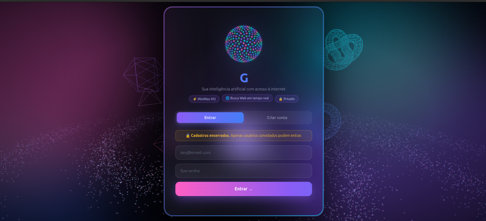
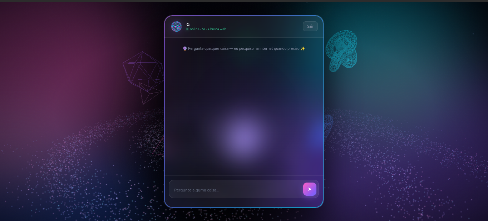

# chatminig


[English version](README.md)

Aplicação web de chat com IA, com autenticação de usuários e resposta em áudio.

O projeto foi criado para praticar front-end sem framework, integração com backend gerenciado e consumo de APIs de modelos de linguagem de forma segura.

Demo: https://engdesoftwareg.github.io/chatminig/

## Telas

Tela de login



Interface de conversa



## Funcionalidades

Login e cadastro por e-mail e senha, com sessão persistente e logout.
Interface de conversa em tempo real, com histórico enviado ao modelo para manter contexto.
Conversão das respostas em áudio (text-to-speech).
Controle de cadastro: o registro de novos usuários pode ser bloqueado sem afetar quem já tem conta.

## Tecnologias

HTML, CSS e JavaScript puro (sem framework), em arquivo único.
Supabase para autenticação.
Supabase Edge Functions para as rotas de chat e de síntese de voz.
SDK supabase-js carregado via ESM.

## Decisão de arquitetura

As chamadas ao modelo de linguagem e ao serviço de voz não acontecem no navegador: elas passam por Edge Functions.
Assim as chaves de API ficam no servidor e nunca são expostas no código do cliente.

## Como executar

Clone o repositório e abra o arquivo `index.html` no navegador, ou sirva a pasta com qualquer servidor estático:

```bash
git clone https://github.com/engdesoftwareg/chatminig.git
cd chatminig
python -m http.server 8000
```

Depois acesse `http://localhost:8000`.

Para usar com o seu próprio backend, configure um projeto no Supabase, publique as funções `chat` e `tts` e ajuste a URL e a chave pública no início do `index.html`.

## Estrutura

```
index.html    aplicação completa (markup, estilos e lógica)
```

## Licença

MIT
